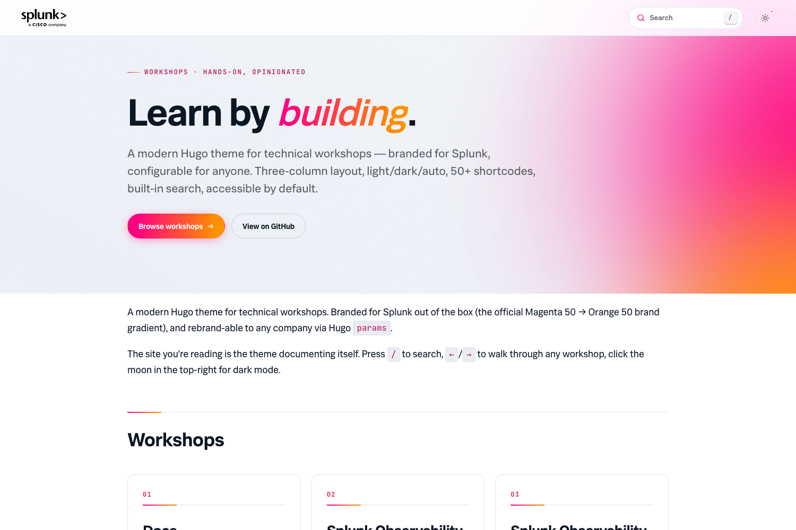

# Splunk Workshop Theme

**Reach for this theme if you're building hands-on technical workshops** with multi-chapter structure and want dark mode, fuzzy search, presenter notes, keyboard navigation, and 50+ workshop-specific shortcodes (steps, exercises, solutions, quizzes, terminal blocks, file trees, callouts, tabs, …) out of the box. Splunk-branded by default; fully rebrand-able via `params` for any company.

If you're writing self-paced reference docs rather than workshops, [hugo-theme-relearn](https://github.com/McShelby/hugo-theme-relearn) or [hugo-theme-docsy](https://github.com/google/docsy) may fit better — this theme is opinionated about the *workshop* format (linear chapter flow, presenter mode, pedagogy shortcodes) and trades some general-purpose flexibility for that.



**📖 Live demo & full docs: <https://splunk.github.io/hugo-theme-splunk-workshop/>**

## Features

- **Three-column workshop layout** — sidebar (chapter nav) · prose · on-this-page TOC
- **Light / Dark / Auto** with manual toggle and `prefers-color-scheme`
- **Built-in search** — `/` or `⌘K` opens a fuzzy modal over a JSON index
- **Keyboard navigation** — `←` / `→` step through workshop pages
- **50+ shortcodes** — callouts, steps, exercises, tabs (with sync), terminal, kbd, file-tree, image, quiz, presenter notes, mermaid, math, cards, children, and more
- **Splunk Data Sans Pro** display/body + **JetBrains Mono** code — same family as `splunk.github.io/observability-workshop`
- **Accessible by default** — `:focus-visible` rings, ARIA-correct tabs, skip-to-content link
- **i18n-ready** — every UI string lives in `i18n/en.yaml`
- **Print-friendly** — workshops print cleanly with no chrome
- **No build dependencies** — pure Hugo extended; no PostCSS, no Node toolchain

> Requires Hugo **0.125+** extended.

## Install

Three install methods, in order of preference:

```bash
# 1. Hugo Module — version-pinned, easy upgrades
hugo mod get github.com/splunk/hugo-theme-splunk-workshop

# 2. Git submodule — no Go required
git submodule add https://github.com/splunk/hugo-theme-splunk-workshop.git \
  themes/hugo-theme-splunk-workshop

# 3. Direct download
curl -L https://github.com/splunk/hugo-theme-splunk-workshop/archive/refs/heads/main.tar.gz \
  | tar -xz -C themes/
```

Step-by-step instructions, troubleshooting, and a minimal `hugo.toml` are in the
[Getting Started docs](https://splunk.github.io/hugo-theme-splunk-workshop/docs/getting-started/).

## Quick start

Two paths, depending on what you're doing.

### A. Try the theme / contribute — clone and run the demo

```bash
git clone https://github.com/splunk/hugo-theme-splunk-workshop.git
cd hugo-theme-splunk-workshop
make serve         # http://localhost:1313
```

That serves the [`exampleSite/`](exampleSite/) directory — the live demo at the URL above. The demo IS the docs: search, navigate, toggle dark mode, see every shortcode in context. Edit anything under `exampleSite/content/` and the browser reloads on save.

### B. Build your own workshop site

Two sub-options, depending on whether you want the theme as an isolated *site* (you author content in this repo) or as a *dependency* (you author content in your own repo).

**Author in this repo** — fastest start, no setup beyond cloning:

```bash
git clone https://github.com/splunk/hugo-theme-splunk-workshop.git my-workshop
cd my-workshop
hugo new --kind workshop content/workshops/my-workshop/01-intro.md
hugo server         # http://localhost:1313 — serves YOUR content/
```

**Install as a dependency** — recommended for production sites you want to keep upgrade-able. See the [Install docs](https://splunk.github.io/hugo-theme-splunk-workshop/docs/getting-started/01-install/) for the three install methods (Hugo Module, submodule, direct download).

## Documentation

Everything lives at [splunk.github.io/hugo-theme-splunk-workshop](https://splunk.github.io/hugo-theme-splunk-workshop/):

- [**Getting started**](https://splunk.github.io/hugo-theme-splunk-workshop/docs/getting-started/) — install, first page, deploy
- [**Customizing**](https://splunk.github.io/hugo-theme-splunk-workshop/docs/customizing/) — colors, typography, logos, layout toggles
- [**Shortcodes**](https://splunk.github.io/hugo-theme-splunk-workshop/docs/shortcodes/) — live reference for every shortcode
- [**Authoring**](https://splunk.github.io/hugo-theme-splunk-workshop/docs/authoring/) — front matter, archetypes, navigation model
- [**Advanced**](https://splunk.github.io/hugo-theme-splunk-workshop/docs/advanced/) — Hugo Modules, presenter mode, search internals, i18n

## Development

```bash
make serve         # demo on http://localhost:1313 with live reload
make build         # production build to exampleSite/public/
make check         # build with strict logging
make stats         # line counts for templates / CSS / JS
make shortcodes    # list every shortcode shipped
make screenshot    # refresh images/screenshot.png and images/tn.png
```

See [CONTRIBUTING.md](CONTRIBUTING.md) for code conventions, the test loop, and release process.

## Credits

This theme is a relearn-compatible drop-in. Credit to [hugo-theme-relearn](https://github.com/McShelby/hugo-theme-relearn) by [Sören Weber](https://github.com/McShelby).

## License

MIT — see [LICENSE](LICENSE).

The Splunk wordmark and brand colors belong to Splunk Inc. (a Cisco company). This theme is an unofficial community project; rebrand the params for any non-Splunk use.
