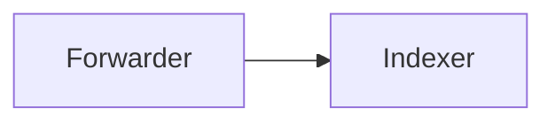

+++
title       = "Math, diagrams, video, presenter"
description = "Heavyweight shortcodes that load external libraries — only on pages that use them."
weight      = 50
+++


Math, diagrams, and video are expensive — KaTeX is ~150KB, Mermaid is ~700KB. The theme lazy-loads each one only when a page actually uses it, via `Page.Store` flags read in the footer.


## Math (KaTeX)


e^{i\pi} + 1 = 0



\text{p95} = \inf\{x : F(x) \geq 0.95\}


```markdown

e^{i\pi} + 1 = 0

```

The shortcode wraps your LaTeX in `$$ … $$` (display mode) and flags the page so KaTeX is loaded from CDN in the footer. Pages without a `math` shortcode pay zero cost.

By default the block is centered; pass `align="left"` (or `right`) to change it:

```markdown

\sum_{i=1}^{n} i = \frac{n(n+1)}{2}

```

For inline math, use raw `$ … $` (KaTeX's `auto-render` extension picks both up):

```markdown
The complexity is $O(n \log n)$ — see the proof below.
```

The CDN URL is pinned in `layouts/_partials/chrome/footer.html` with an SRI hash. Bump the version there when KaTeX releases an update.

## Diagrams (Mermaid)


graph LR
  A[Forwarder] --> B[Indexer]
  B --> C[Search Head]
  C --> D[Dashboard]


Three equivalent ways to author a diagram:

```markdown

graph LR
  A[Forwarder] --> B[Indexer]

```

```markdown
{}
graph LR
  A[Forwarder] --> B[Indexer]
{}
```

````markdown

````

The angle-bracket shortcode (``) is the most predictable form — Hugo passes `.Inner` through untouched. The percent form (`{}`) lets the inner block participate in markdown so it survives being nested inside other percent-form shortcodes (e.g. `{}`); the theme strips the blank lines Goldmark would otherwise treat as HTML-block terminators. The fenced `​```mermaid` block is registered through the theme's code-block render hook — convenient if your editor highlights mermaid in fenced blocks and you prefer to avoid shortcode syntax altogether.

Mermaid auto-rerenders when you toggle light/dark mode — a `MutationObserver` on `data-theme` triggers a re-init. Same lazy-load pattern: only pages using one of the three forms pull the module.

### Icons inside diagrams

Labels can reference any icon in [`data/icons.toml`](https://github.com/splunk/hugo-theme-splunk-workshop/blob/main/data/icons.toml) using a `lucide:NAME` token. The theme substitutes the token with inline SVG before mermaid renders, so the diagram ships with vector icons without any external font load.


graph LR
  A["lucide:download Collector"] --> B["lucide:cpu Processor"]
  B --> C["lucide:upload Backend"]


```markdown

graph LR
  A["lucide:download Collector"] --> B["lucide:cpu Processor"]
  B --> C["lucide:upload Backend"]

```

For migrating diagrams that still use Font Awesome syntax, the same substitution accepts `fa:fa-NAME` and maps a small set of common aliases (`fa-download` → `download`, `fa-upload` → `upload`, `fa-microchip` → `cpu`, `fa-route` → `route`). Unknown FA names pass through untouched; the diagram still renders, just without the icon.

Tune the icon size site-wide via:

```toml
[params]
  mermaidIconSize = 24   # default; pixels
```

### Security mode and HTML in labels

The theme sets mermaid's `securityLevel: "antiscript"`. This matches relearn's default and allows `<br>`, `<strong>`, `<em>`, `&nbsp;`, and similar inline HTML in node labels (useful for line breaks and emphasis inside diagrams) while still blocking `<script>` tags and click handlers via mermaid's bundled DOMPurify. If you need a stricter or looser mode, the only place to change it is in [`layouts/_partials/chrome/footer.html`](https://github.com/splunk/hugo-theme-splunk-workshop/blob/main/layouts/_partials/chrome/footer.html) — there's no site param for it (mermaid only sets the policy once at init time, so swapping it dynamically per page isn't useful).

### Background and theming

Mermaid normally paints its own canvas (white in default theme, dark slate in dark) plus a cream-yellow cluster fill (`#fff5ad`) for subgraphs. The theme overrides all four surface tokens (`background`, `clusterBkg`, `clusterBorder`, `secondaryColor`, `tertiaryColor`) to `transparent` so the diagram sits on the page's own `--color-surface` rather than introducing a fifth surface tint. Node and edge colors stay theme-driven by mermaid's default/dark palette; your `classDef` overrides in author content still win.

## Inline slide decks

`` embeds a [reveal.js](https://revealjs.com/) slide deck inline in a workshop page. Authors write markdown inside the shortcode with `---` between slides; on click, the deck mounts in a fullscreen overlay over the workshop. Esc closes; arrow keys advance.

````markdown

## The pipeline

Splunk takes **raw events**, runs them through a small set of well-named
stages, and gives you back a queryable index.

```text
forwarder → indexer → search head
```

---

## Forwarder

A small agent that watches files or sockets and ships events.

- Runs on the host generating the data
- Tails logs, reads syslog, listens on a TCP port

---

## What you'll build today

Close this deck and read on for the install.

````

### What it renders

A small brand-coloured "Slide deck · N slides" preview card in normal article flow, with an "Open presentation" button. Click → reveal.js loads from CDN (one-time ~75KB) and the deck mounts fullscreen on top of the workshop. The reader scrolls past the card to reach whatever comes next (an exercise, the next chapter, etc.).

### Author conventions

- **Separator.** A horizontal rule (`---`) on its own line splits one slide from the next. The shortcode tolerates blank lines around the separator — both forms work:

  ````markdown
  ## Slide one
  Body…

  ---

  ## Slide two
  ````

- **Markdown inside slides** goes through Hugo's normal markdown pipeline. Code fences with chroma highlighting, images, links, lists, and other shortcodes all work. The theme strips workshop-specific chrome (heading top-borders, code-block file-name bars) inside the slide so the deck reads cleanly on its dark background.

- **Images.** `` works straight through — images are auto-sized to fit within 80% width and 60vh height, centred. Hugo's image render hook handles relative paths for page-bundled images.

- **Alignment.** Slide content is **left-aligned by default** — better for the bullet-list + code-block + paragraph-prose content workshops are made of. Reveal.js's stock styles centre everything (great for TED talks, wrong for technical decks); the theme overrides that. To centre a specific slide (cover slide, big takeaway, hero quote), use reveal.js's native class-comment pattern *inside* the section:

  ````markdown
  
  ## Default left-aligned slide
  - Bullet one
  - Bullet two

  ---

  <!-- .slide: class="center" -->
  ## Big takeaway
  Centred for impact.
  
  ````

  The `<!-- .slide: class="..." -->` syntax is a [reveal.js convention](https://revealjs.com/markdown/#element-attributes) — the comment is parsed off the front of the section and applied as a class on the `<section>` element. The theme ships a `.center` rule; other reveal classes (`has-light-background`, `aligncenter`, etc.) work via the standard reveal.js mechanism. Authors can also define their own per-slide classes and target them in site CSS.

### Args

| Arg | Default | Purpose |
| --- | --- | --- |
| `title` | `"Presentation"` | Heading shown on the preview card. Pipes through `markdownify`. |
| `label` | i18n `slidesOpen` (default `"Open presentation"`) | CTA label on the button. |

### Presenter-mode gate

By default the preview card is **hidden**, so attendees don't see the deck on their normal scroll-through. It appears only when presenter mode is on — same `[data-presenter="true"]` toggle as the `` notes shortcode. Toggle with the floating "Presenter" pill, `?presenter=1` URL param, or `P P` (press P twice). The intent: the facilitator opens the deck during the workshop; readers consuming the workshop async don't get distracted by it.

If you want a deck that every reader can launch (e.g. a recorded workshop), you can override the gate with site CSS:

```css
/* In your own site's CSS, after the theme bundle */
.slides-card { display: grid; }
```

### Reveal.js + CDN + SRI

Reveal.js (v6.0.1) is loaded from jsdelivr with [Subresource Integrity](https://developer.mozilla.org/en-US/docs/Web/Security/Subresource_Integrity) hashes pinned in [`assets/js/slides.js`](https://github.com/splunk/hugo-theme-splunk-workshop/blob/main/assets/js/slides.js). The browser refuses to execute the bundle if the CDN ever serves a modified file. Bump `REVEAL_VERSION` in the same file when upgrading and regenerate the hashes:

```bash
curl -sL https://cdn.jsdelivr.net/npm/reveal.js@<v>/dist/reveal.min.js \
  | openssl dgst -sha384 -binary | openssl base64 -A
```

The font (Inter, with the optical-size axis) is loaded from Google Fonts on first open — content there is dynamic, so SRI isn't practical; the blast-radius of a Google Fonts compromise is limited to glyph rendering.

### Why a CDN

Reveal.js is ~75KB minified plus a theme stylesheet — bundling it into every workshop page (including the 99% that have no deck) would inflate the theme's JS bundle for no benefit. CDN delivery on first open keeps the theme bundle small AND caches across workshop sites: a reader who's seen one deck on one Splunk workshop pays nothing on every subsequent deck on every other Splunk workshop.

## Embedded video



```markdown

```

Uses `youtube-nocookie.com` for GDPR-friendlier embedding. The `title` attribute is required for accessibility.

For other video providers (Vimeo, Wistia, etc.), the theme doesn't ship a shortcode — drop the embed iframe directly into your markdown and Hugo's Goldmark with `unsafe = true` will render it.

## Presenter notes

A `presenter` block is hidden by default and revealed when the user enters presenter mode. A floating "Presenter" pill appears in the bottom-right of any page that has presenter notes; clicking it (or pressing `P` twice in quick succession, or appending `?presenter=1` to the URL) toggles the mode.


This block only appears when the floating "Presenter" pill is toggled on. Use it for delivery cues — timing notes, "kick off the demo container in the background", "remind people about the lunch break".

Don't hide answers here — attendees can see the markup in view-source.


```markdown

Start the EC2 instance — boot takes ~3 minutes.



Allow 10 minutes for attendees to finish this section.

```

The state persists in `localStorage`, so once you toggle presenter mode it stays on as you navigate between pages — useful for live workshops where you want notes available throughout.


The markup is in the page source. Attendees who view-source can see them. Use presenter notes for delivery cues and timing only — not for hidden answers to exercises.


## Webex chat simulation

Simulate a Cisco Webex conversation as the narrative device that opens an exercise — "your manager just pinged you about a customer complaint, here's what you'd see". Renders the full Webex chat UI (header, tabs, stacked message stream, "Seen by" indicator, composer footer) as decorative chrome around a sequence of messages you author yourself. Matches the real Webex desktop client's layout — all messages are left-aligned with avatar + name + time + body; the current-user case (`me=true`) swaps the initials disc for a chat-bubble glyph and defaults the name to "You". The chat surface follows the page's light/dark theme — flip the site theme and the chat flips with it, just like the real Webex client.



Hey! We're getting reports of a potential customer satisfaction issue with the Online Boutique application. Can you do the first triage and see what's going on?



Sure, I'll start by checking RUM in Splunk Observability to see what the users are experiencing. 👍



```markdown


Hey! We're getting reports of a potential customer satisfaction issue
with the Online Boutique application. Can you do the first triage?



Sure, I'll start by checking RUM in Splunk Observability. 👍


```

### Multi-turn conversation with multiple senders

Each ```` is independent, so you can interleave senders freely. Use the `color` param to give each person their own avatar tint.



Hey! I've triaged a customer satisfaction issue with Online Boutique. RUM shows poor page load times. I traced a user session to the backend using Related Content — the latency is coming from the **paymentservice**.



Can you dig into the back-end and find the root cause? I'll send you a link to the trace.



On it. I'll check APM and the service map. 👍



### Parameters

**````** (parent — chat container):

| Param | Default | Notes |
| --- | --- | --- |
| `chat` | `Chat` | Name in the header bar (also used as the input placeholder). |
| `status` | `Available` | Status text under the name. |
| `date` | `Today` | Centred date divider. Free-form — `Today • 28/01/2026`, `Yesterday`, `Last Tuesday`. |
| `seenby` | — | Initials of the avatar shown under "Seen by". Omit to hide the indicator. |
| `seenby-color` | Webex green | CSS colour for the seen-by avatar. |

**````** (child — one message):

| Param | Default | Notes |
| --- | --- | --- |
| `from` | — | Initials shown in the avatar disc. Ignored when `me=true` (the chat-bubble glyph replaces it). |
| `name` | — / `You` | Sender's full name (above the body). Defaults to `You` when `me=true`. |
| `time` | — | Timestamp string (e.g. `09:42`, `Thursday, 15:35`). Free-form, no parsing. |
| `color` | Webex green | Avatar disc background colour. Override per-sender to distinguish multiple voices. Ignored when `me=true`. |
| `me` | `false` | When `true`, the message uses the gray chat-bubble avatar and defaults the name to `You` — matching how Webex renders the current user's own messages. |

Message bodies support full markdown — `**bold**`, `*italic*`, `` `code` ``, links, emoji.
